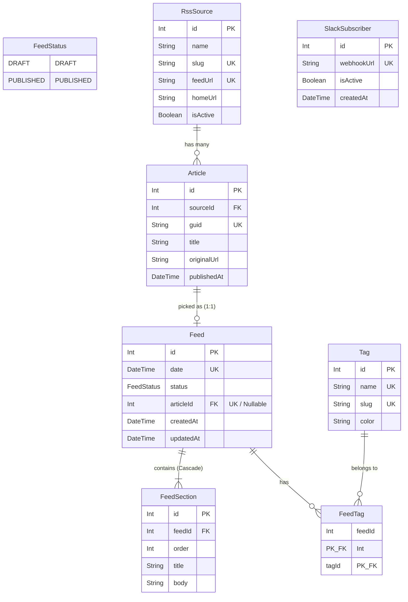

# CLAUDE.md

This file provides guidance to Claude Code (claude.ai/code) when working with code in this repository.

## Commands

```bash
# 루트 (전체 워크스페이스)
npm run dev          # web(:3000) + server(:4000) 동시 실행
npm run build        # 전체 빌드
npm run type-check   # 전체 타입 체크

# apps/server
npm run crawl        # RSS 크롤링 수동 실행
npm run summarize    # AI 요약 수동 실행 (내일 피드 DRAFT 생성)
npm run publish      # 오늘 DRAFT → PUBLISHED 수동 전환
npm run db:migrate   # Prisma 마이그레이션
npm run db:seed      # RssSource 5개 + Tag 8개 시드
npm run db:studio    # Prisma Studio
```

`.env` 필수 변수: `DATABASE_URL`, `OPENAI_API_KEY`, `NEXT_PUBLIC_API_BASE_URL`

---

## 아키텍처 개요

**Turborepo 모노레포** — `apps/web` (Next.js 16) + `apps/server` (Express 4)가 각각 독립 서버로 실행됩니다.

```
web(:3000) ──fetch──▶ server(:4000)/api/v1/...
                              │
                         Prisma ORM
                              │
                        PostgreSQL DB
```

---

## 데이터 아키텍처



---

## 데이터 모델 핵심

```
RssSource → Article (1:N, guid unique)
Article   → Feed    (1:1 optional)
Feed      → FeedSection (1:N, 피드당 3개)
Feed      ↔ Tag     (N:M via FeedTag)
```

`Feed.status`: `DRAFT` (생성 직후) → `PUBLISHED` (08:00 publish job)

허용 태그 8개: `React, AI, DB, DevOps, Mobile, Backend, Frontend, Security`

---

## OG 이미지 백필

기존 Article에 ogImage가 없을 때: `apps/server/prisma/backfill-og.ts` 실행

```bash
cd apps/server && npx ts-node prisma/backfill-og.ts
```
